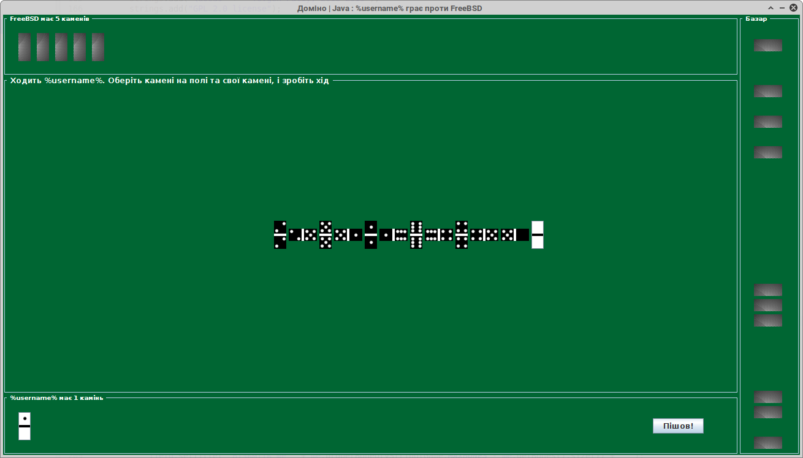

# Classic domino game (Swing AWT)

Java-written, minimal-size-driven application for playing classic domino

## Installation and usage (tested on Linux / Windows)

* Clone current git repository to local machine

`git clone https://github.com/evgenpatiy/game-domino-swing.git`

* Compile source code using command below. Warning: existing [Java 8](https://java.com/en/download/) and [MAVEN](https://maven.apache.org/) installation required!
   
`mvn clean compile assembly:single` 

* "target" directory will be created, find **domino-1.0-SNAPSHOT-jar-with-dependencies.jar** inside and run application as per below, or just double-click on it, if your 
operating environment enables it

`java -jar domino-1.0-SNAPSHOT-jar-with-dependencies.jar`

## Gameplay

## Author

- Yevgen Patiy

## License

Feel free to use, modify or distribute this software. This project is licensed under the [GNU GPL 2.0 license](https://www.gnu.org/licenses/old-licenses/gpl-2.0.uk.html).
